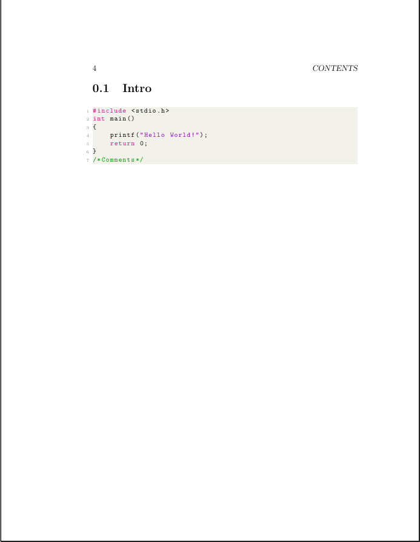

# Code Template Example
In the last section we decided to create a project on the basics of 
golang, and chose to use the Code template. So let's specify the other parts of our project: 

```toml
[Project]
author = "Mustafif"
title = "A Little Golang"
date = "\\today"
project_name = "Golang_Book"
template = "Code" #Make sure to have first letter upercased

[Document]
paper_size = "letterpaper"
font_size = 11 #font size number
document_class = "book"
packages = []
```
With that set, let's create our project:
```shell
# import assumes you're using config.toml
$ texcreate build
# check directory
$ ls
config.toml Golang_Book
# Go into Golang_Book
$ cd Golang_Book
# check directory
$ ls
Golang_Book.tex structure.tex
```
Now we have two files, and each serves a different purpose: 
- Golang_Book.tex: This is the main file that will be compiled
- structure.tex: This is the file that will contain all packages and stuff like that

If we run `pdflatex Golang_Book`, we see this introductory pdf:



---
Let's change this to a Golang example: 
1. First in the `structure.tex` file change `\lstset{language=c}` to `\lstset{language=go}`
2. Next we will give a simple example of creating a simple recursive fibonnaci program:
```go
package main

import "fmt"

func main() {
    var fib func(n int) int
    fib = func(n int) int {
        if n < 2 {
            return n
        }
        return fib(n-1) + fib(n-2)
    }
    fmt.Println(fib(7))
}
```

So remove the C program and add the code in the `lstlisting` environment, as seen below:
```latex
% Code Template 
% MKProjects TexCreate 2021 
% MIT & GPLv2 License
\documentclass[11pt, letterpaper]{book}
\input{structure.tex}
\author{Author}
\date{\today}
\title{A Little Golang}

\begin{document}
\maketitle
\newpage
\tableofcontents
\newpage
\section{Intro}
% To use listings with code on text, use the following command:
\begin{lstlisting}
package main

import "fmt"

func main() {

    var fib func(n int) int

    fib = func(n int) int {
        if n < 2 {
            return n
        }
        return fib(n-1) + fib(n-2)

    }

    fmt.Println(fib(7))
}
\end{lstlisting}
% To use external code, use the following command:
%\lstinputlisting{file.c}
\end{document}
```
We could also save the code in a file and use `\lstuiinputlisting{file.go}`